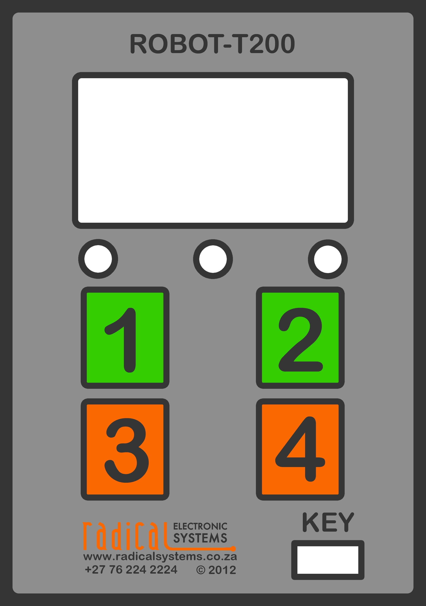
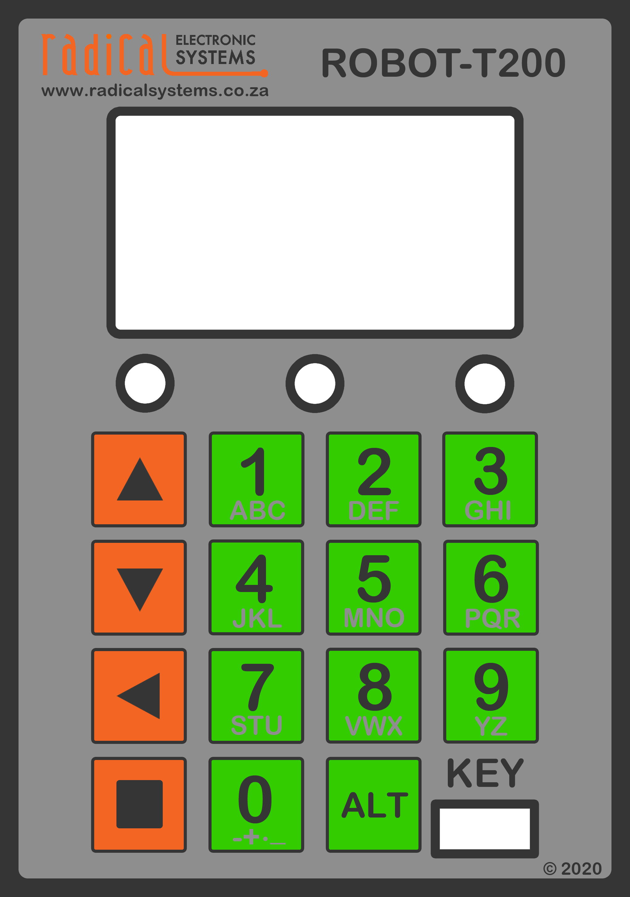
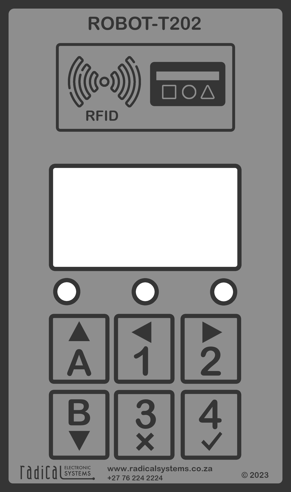
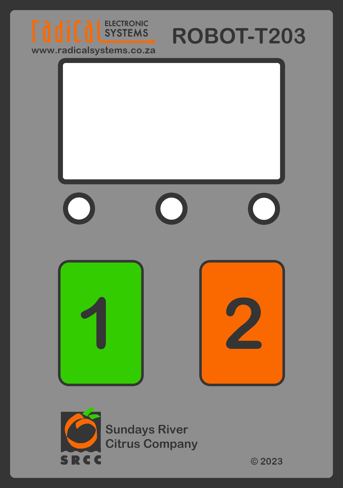

# Robot T200/T400 demo server
This server demonstrates the capabilities of the Radical ES Robot Packhouse terminal. It implements the full set of the [Robot API](api/robot-api.md). It show how to response to a Robot configuration request and regular pings. 

# Variants
|Robot-T200|Robot-T201|Robot-T202|Robot-T203|
|:---:|:---:|:---:|:---:|
|||||

## Implementation Supported

* Robot Configuration
* Pallet Scales
* Scanner Stations
* QC Points
* Forklift Pallet Movement
* On demand label printing
* Time and Attendance

## To get up and running
1. Install NodeJS
2. Clone the repo
3. run npm install & npm start
4. Configure server with robot in [Server Configuration](config.json)
5. Connect your Robot to the same LAN and fillout the Setup URL with the server IP and port

## Further Development
We are in the process of adding support for the following:
* Fuel Dispensing - Prowalco Dispensors
* Chemicals Dispensing - Farm related activities