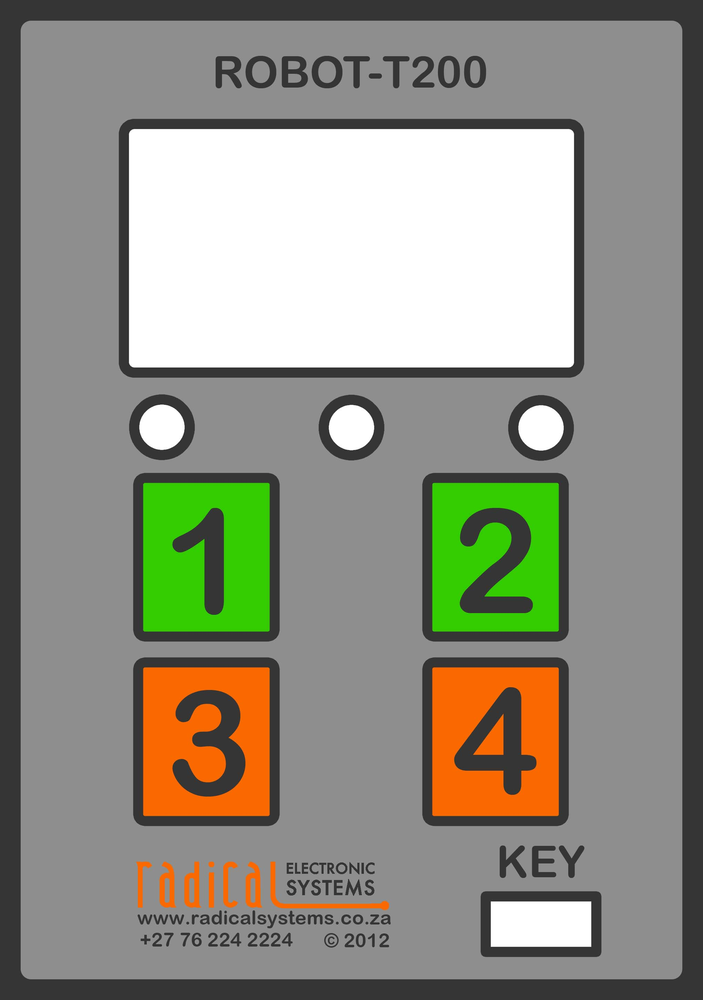
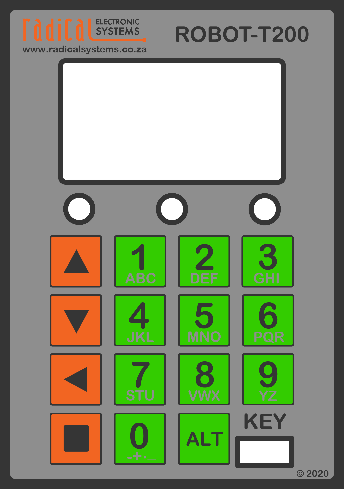
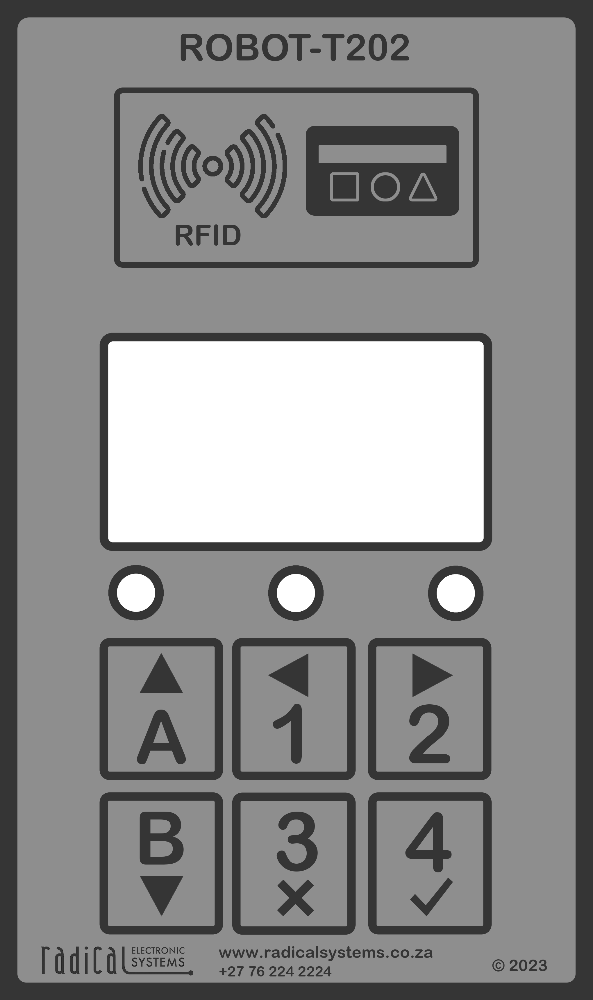
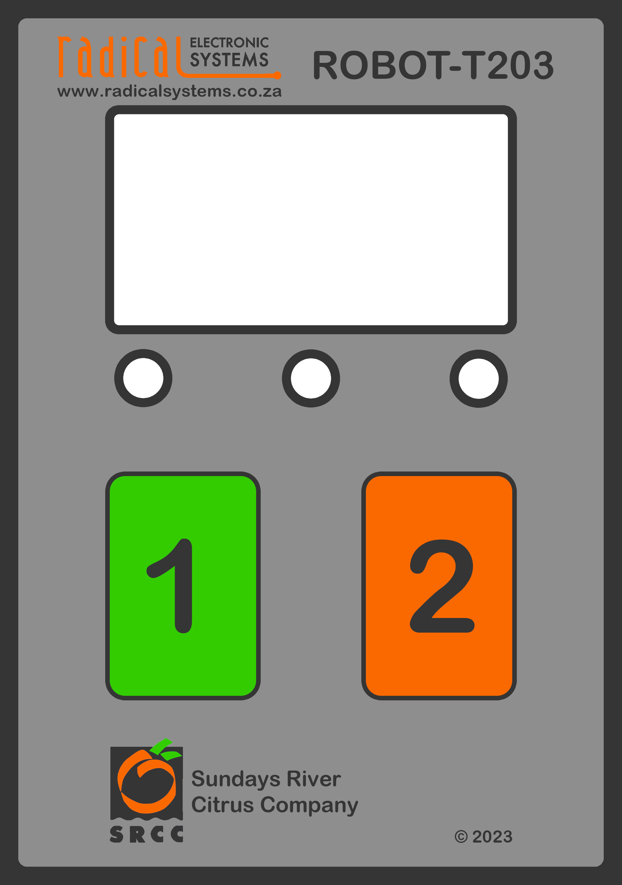

# Robot T200/T400 demo server
This server demonstrates the capabilities of the Radical ES Robot Packhouse terminal. It implements the full set of the [Robot API](api/robot-api.md). It show how to response to a Robot configuration request and regular pings. 

# Variants
|Robot-T200|Robot-T201|Robot-T202|Robot-T203|
|:---:|:---:|:---:|:---:|
|||||

## Implementation Supported

* Packer Terminals
* Pallet Scales
* Scanner Stations
* QC Points
* Forklift Pallet Movement
* Bin Tip and Intakes
* On Demand Label Printing
* Time and Attendance

## Writing a server for these terminals

A Robot posts JSON to one URL, and your server answers. That is the entire
protocol. There is no handshake, no socket to hold open, and no path to route
on — the command is a named object inside the message:

```json
{ "requestPing": { "MAC": "AA:BB:CC:00:11:22" } }
```

and the answer is a named object back:

```json
{ "responsePong": { "status": "OK", "MAC": "AA:BB:CC:00:11:22" } }
```

So a server is: read the name, decide what to do, answer. This one is that, in
three files worth reading before you write your own.

### Run it

```sh
npm install
npm start                    # port 8086, or PORT=9000 npm start
npm run web:build            # the dashboard, then open http://localhost:8086/
```

Point a Robot's Setup URL at `http://<your machine>:8086/setup.cgi`, or try it
without one:

```sh
curl -s -X POST http://localhost:8086/robot/api/ \
  -H 'Content-Type: application/json' \
  -d '{"requestPing":{"MAC":"00:60:35:14:29:72"}}'
```

### The three files

| | |
|---|---|
| [`protocol/packets.js`](protocol/packets.js) | **start here.** One entry per command: a sentence saying what it is for, the name it answers with, and a function returning the answer. This is the whole API surface. |
| [`protocol/index.js`](protocol/index.js) | the dispatcher. Reads the name, calls the entry, wraps the reply. Seventy lines, and nothing about any particular command is in it. |
| [`protocol/state.js`](protocol/state.js) | what this demonstration remembers — terminals, people, pallet spaces. Yours will be a database. |

### Adding a command

```js
requestPing: {
  summary: 'The Robot checks the server is still there, every few seconds.',
  responseName: 'responsePong',
  reply: ({ MAC }, { robot }) => (robot ? ok({ MAC }) : null),
},
```

`reply` receives the packet's contents and a context — the Robot it came from,
and the server. Return a plain object and the dispatcher wraps it. Return
`null` to say nothing at all, which is different from saying it failed.

Nothing else changes. That is the point of the table.

### Which URL

`POST /robot/api/` is the one to use. The old `.cgi` paths — `/setup.cgi`,
`/scale.cgi`, `/term.cgi`, `/scan.cgi`, `/label.cgi`, `/forklift.cgi` — answer
identically, because the path never carried any meaning: the command was always
in the message. They are here so a Robot holding a URL somebody typed into it
years ago keeps working.

### Which Robots

[`config.json`](config.json). A Robot that is not in it is told `DISABLED`
rather than guessed at, which is what a real server should do too: a terminal
that nobody has configured should not be handed a configuration.

### Four things worth copying

**An unrecognised card is an answer, not an error.** It is the commonest thing
that happens at a terminal. A server that treats it as a fault teaches every
app built against it to treat it as one.

**A message with two commands in it is refused.** That is a bug at the other
end, and guessing which was meant is how a terminal does something nobody asked
for.

**A fault in one packet does not end the conversation.** The Robot asks again
in a few seconds regardless; a server that stops answering is harder to
diagnose than one that says what went wrong.

**A version the Robot did not report is left alone.** Absent means "not
reported", which is not the same as empty — writing an empty string over a
known version loses it.

### The protocol itself

[`api/robot-api.md`](api/robot-api.md) describes every packet and when it is
sent. [`api/packet.json`](api/packet.json) is the same as machine-readable
shapes. The dashboard at `/` lists what this server implements, generated from
the table that implements it — so it cannot claim a command it does not have.

## Further Development
We are in the process of adding support for the following:
* Fuel Dispensing - Prowalco Dispensors
* Chemicals Dispensing - Farm related activities