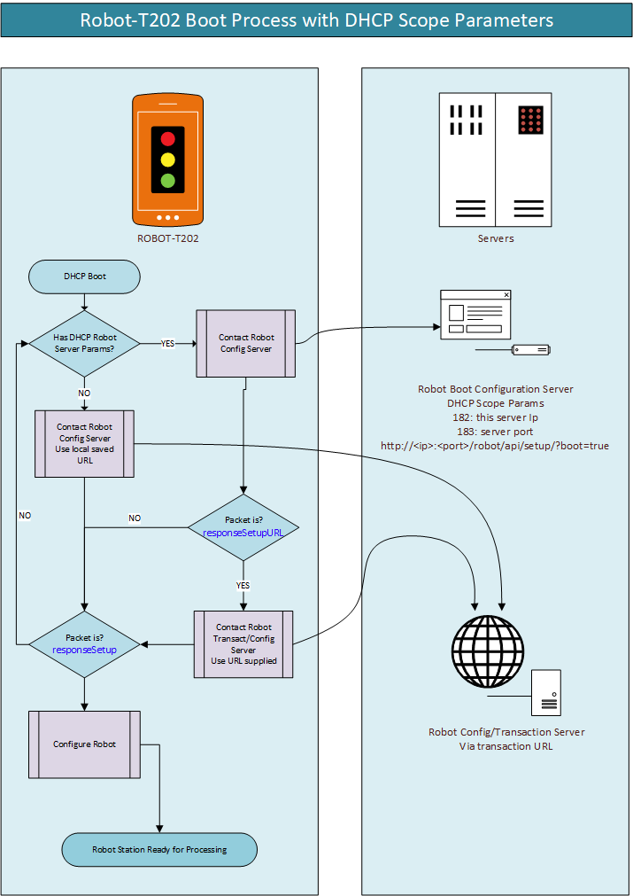

# Robot Application Program Interface

## Introduction
The Robot API uses HTTP to generate transactions via the POST verb on a single URI. 
Transactions are request-response based with a named action in the payload.

A Payload is in JSON format and is contained in the body of the HTTP transaction.
Each payload contains a single named JSON object. The name of the 
object is the command to interpret with the object contents as its parameters.

Basic format of the payload is as follows:

```JSON
{
    "requestCommand" : {
        "param1" : "data1",
        "param2" : "data2"
    }
}
```

## Architecture
Communications is based on a client-server topology and this is implemented bidirectionally, the server and the Robot. Not all commands are supported by both ends.

The Robot requires a boot configuration that is supplied by a configuration- server. There after communications continue on a transaction-server. Splitting concerns for configuration and transaction is not necessary on smaller installations.

Robots and their API is designed to run at scale with zero network administration requirements. A server configuration provider can reboot or reconfigure a Robot or cluster of Robots at will. Network parameters or application settings can be changed at run time.

## Robot Operations
Basic purpose of the Robot is to link packhouse floor operations to IT systems in a deterministic manner. A LCD screen, LEDs & Buttons provide user interaction. One or two scanners can be attached for QC or palletizing purposes. Or a scale and scanner for SOLAS scales. The Robot and its API provide a single point and consistent solution to real world requirements in packhouses. It make it easy for IT systems to connect various operations in packhouses in a simplistic manner. The Robot provides a specified bridge between packhouse floor operations and IT systems.

## DHCP Optional Parameters
It is possible to configure the Robot terminal without accessing the device directly.
The Robot support additional DHCP scope parameters while acquiring its leased address. Two addtional paramters can be included specifying an IP address and port which can provide its runtime configuration. It is also possible that this server only serve as a first hop to provode the next location of an configration resource server.

### Optional Parameters Details
The table below details the optional parameter values.
|Scope Name|Value|Type|Example|
|:---:|:---:|:---:|:---:|
|Robot Server Ip Address|182|4 byte ip address|192.168.1.100|
|Robot Server Port|183|16-bit number|8080| 

### Boot Setup Request URL
The Robot setup request URL is fixed and assembled from the DHCP options provided IP address and port. Below is the format of the URL. A server will need to listen at that endpoint and either provide the URL of the next setup server, or provide a full runtime setup to the Robot.

#### Assembled URL format
http://[server-ip]:[port]/robot/api/setup/?boot=true

### Diagram of boot process


#### The boot process
1. The Robot will look for additional parameters 182 & 183.
2. If found it will contact the server with an *requestSetup* packet.
3. The response can be *responseSetup* or *responseSetupURL*.
4. *responseSetup* must provide a full setup for the Robot to operate from.
5. *responseSetupULR* only provides an URL of a contactable resource that can provide a complete runtime setup.
6. In the case where the optional parameters are not present, the Robot will use the locally stored URL, set via its web GUI, as the location to contact for a runtime setup.


<details><summary>Basic Command Structure</summary>

<p>

## Payload Layout
All payloads has exactly one command and one object. The object contains the parameters associated with the command. A MAC address must always be present in the object.

### Basic command layout
Below is the basic payload command structure.
```JSON
{
    "payloadCommand" : {
        "MAC" : "AA:BB:CC:00:11:22",
        "parameterName" : "parameterValue"
    }
}
```

### Reset Command
The server can respond with reset to any command to trigger a reboot on the Robot
```JSON
{
    "requestReset" : {
        "MAC" : "AA:BB:CC:00:11:22"
    }
}
```


</p>
</details>


<details><summary>Informative Commands</summary>
Information request commands are send to the device and the response provides details of the device.
<p>

## Information Request
A request contains the MAC address of the device and must match to get a valid response.
```JSON
{
    "requestInformation" : {
        "MAC" : "AA:BB:CC:00:11:22:"
    }
}
```

### Information Response
The response contains the hardware and software versions. The type describes the device and uptime is the running time in seconds.
```JSON
{
    "responseInformation" : {
        "MAC" : "AA:BB:CC:00:11:22",
        "hardware" : "1a",
        "software" : "1.0.1",
        "type"     : "ROBOT-T201",
        "uptime"   : "1000"
    }
}   
```

### Status Request
Status request can be send to get the current state of the device. Generally the device will send a status update once it booted. The MAC address is a required object parameter and must match the device address.

```JSON
{
    "requestStatus" : {
        "MAC" : "AA:BB:CC:00:11:22"
    }
}
```

### Status Response
Upon boot up or specifically requested the device will publish its status as follows:
```JSON
{
    "publishStatus" : {
        "status" : "READY/!READY",
        "system" : "ENGINE/SCALE/SCANNER",
        "message" : "Descriptive message when in error",
        "MAC" : "AA:BB:CC:00:11:22",
        "session" : "0123456789abcdef"
    }
}
```

</p>
</details>


<details><summary>General Commands</summary>
General commands include, reset, ping and date-time.
<p>

### Ping-Pong
The Robot will continuously ping the server to make sure the network is functional and the server is operational. Upon a Ping command the server should respond with a Pong. A reset response can also be send to reboot the Robot.

#### Ping Request
```JSON
{
    "requestPing" : {
        "MAC" : "AA:BB:CC:00:11:22",
        "session" : "0123456789abcdef",
        "firmware" : "ITPC200-COCPU-1.3-7d2ada55",
        "deviceWebApp" : "1.3.46",
        "rootfs" : "T430-R5H"
    }
}
```

The same version fields as `requestSetup`, so a terminal that installs
something without rebooting is recorded without waiting for one. The server
writes only on a change, so repeating them costs nothing.

`deviceWebApp` does double duty here: it is recorded, and it is what the server
compares against the bundle it holds. Absent reads as "anything is newer",
which is what a terminal with no app installed wants.
#### Pong Response
```JSON
"responsePong" : {
        "MAC" : "AA:BB:CC:00:11:22"
    }
```

### Date Time
The Robot can request the current time and date.

#### Date & Time Request
```JSON
{
    "requestDateTime" : {
        "MAC"  : "AA:BB:CC:00:11:22"
    }
}
```
#### Date & Time Response
```JSON
{
    "responseDateTime" : {
        "status" : "OK/FAIL/ERROR",
        "MAC" : "AA:BB:CC:00:11:22",
        "date" : "yyyy-mm-dd",
        "time" : "12:00:00"
    }
}
```

### Reset Command
The reset request can be a response to any command request from the Robot. When an invalid setup is detected or when the server whish to cycle a new configuration request the Robot can simply reboot.
```JSON
{
    "requestReset" : {
        "MAC" : "AA:BB:CC:00:11:22"
    }
}
```

</p>
</details>

<details><summary>Robot Configuration</summary>
On boot the server must provide important information to the Robot. Various settings and the application type as well as the transaction server URL must be specified.
<p>

### Robot Request Setup
```JSON
{
    "requestSetup" : {
        "MAC" : "AA:BB:CC:00:11:22",
        "type" : "SOLAS-Scale",
        "status" : "REQUEST",
        "platform" : "linux",
        "model" : "ROBOT-T430",
        "firmware" : "ITPC200-COCPU-1.3-7d2ada55",
        "deviceWebApp" : "1.3.46",
        "rootfs" : "T430-R5H",
        "controlURL" : "http://192.168.0.50:8080/control",
        "VNC" : "192.168.0.50:5900"
    }
}
```

Everything except `MAC` is optional. An embedded Robot sends what it always
sent; a Linux terminal also says what it is and what it is running.

#### What a terminal reports

Three things version independently, and each is reported under its own name:

| Field | Means |
|---|---|
| `firmware` | The firmware of a processor in front of the peripherals. An ITPC-200 has one presenting its card readers; a T430 or T440 has none and sends nothing. |
| `deviceWebApp` | The web app the terminal is serving. |
| `rootfs` | The image the filesystem was installed from. |

They were one field until 2026-09-03, `firmware`, which carried the rootfs
release - so a device that really did have firmware had nowhere to report it,
and a terminal running a co-processor build that read no cards looked identical
to a working one.

**A value the terminal cannot determine is left out entirely.** Absent means
"not reported" and leaves the last known version alone. An empty string would
overwrite it - and a T430, which has no processor in front of its peripherals,
would erase the firmware recorded against every ITPC-200 sharing a report.

`model` also selects the robot type when it matches one exactly.

### Server Response Setup URL only
```JSON
{

 "responseSetupURL" : {
    "MAC" : "AA:BB:CC:00:11:22",
    "status" : "ENABLED/DISABLED",
    "serverURL" : "http://192.168.0.1/setup.cgi",
 }
}
```

### Server Response Setup
```JSON
{

 "responseSetup" : {
        "MAC" : "AA:BB:CC:00:11:22",
        "status" : "ENABLED/DISABLED",
        "lowLimit" : "850",
        "highLimit" : "1150",
        "units" : "kg",
        "name" : "Weighbridge 1",
        "security" : "OPEN/REQUIRED",
        "protocol" : "ROBOT-API",
        "scale" : "MICRO-A12E",
        "message" : "IDLE MESSAGE",
        "session" : "0123456789abcdef",
        "date" : "yyyy-mm-dd",
        "time" : "12:00:00",
        "type" : "DISABLED/AUTO/TERMINAL/SCALE/SCANNER/BINTIP/FORKLIFT/DUALSCAN/LABELPRINT",
        "serverURL" : "http://192.168.0.1/scale.cgi",
        "signOnUsername" : "JWT etc",
        "signOnPassword" : ""
    }
 
}
```

#### Auto Sign On
If the transaction URL is a protected resource the Robot can automatically sign on to obtain a JWT session Token for instance. The Robot will then automatically add it to the Authorization section of the header as a Bearer token.

</p>
</details>

<details><summary>Operator Sign On/Off</summary>
Operator identification is handled in various manners. The following are supported; RFID cards, USB type I-Button dongles, personel barcode and keypad user codes. Signing out can happen on a timeout, pushed by the server or when removing the USB dongle.
<p>

### Operator Logon
```JSON
{
    "publishLogon" : {
        "MAC" : "AA:BB:CC:00:11:22",
        "id" : "0123456789abcdef",
        "session" : "0123456789abcdef"
    }
}
```

### Operator Logoff
```JSON
{
    "publishLogoff" : {
        "MAC" : "AA:BB:CC:00:11:22",
        "session" : "0123456789abcdef"
    }
}
```

</p>
</details>

<details><summary>Publish Transactions</summary>
A transaction command will always start with the word publish. In some cases a request is initiated before a publish is issued.

<p>

### Device Web App

A Linux terminal serves a web application to itself, and the server decides
which. The terminal reports what it has installed on every ping; the server
answers only when it holds something else.

#### Server offers an app
```JSON
{
    "responseDeviceWebApp" : {
        "MAC" : "AA:BB:CC:00:11:22",
        "status" : "SUCCESS",
        "message" : "New device web app available",
        "deviceWebApp" : {
            "slug" : "device-webapp",
            "version" : "1.3.46",
            "download_url" : "http://server:8080/media/firmware/robot-device-webapp-1.3.46.tar.gz",
            "sha256_checksum" : "1dcf1e79...",
            "size" : 142321,
            "is_latest" : true
        }
    }
}
```

The terminal downloads it, checks the digest, unpacks it beside the running
copy and repoints the name it serves - so the swap needs no reboot and takes
effect on the next page load. `slug` is the name it is served under.

An app installed at the terminal itself, from its own web UI, is left alone:
the terminal records that it owns that app and declines offers for it until
that is handed back. Otherwise a terminal handed an app in front of somebody
was back on the server's within the minute.

### Rootfs Update

A web app is a directory swapped under a symlink and needs no reboot. The
rootfs is the operating system the terminal is running, installed over itself,
and it does reboot - so it is never offered on a ping. The server asks a named
terminal for it, by pushing to that terminal's `controlURL`.

#### Server asks for a release
```JSON
{
    "requestRootfsUpdate" : {
        "manifest" : "ITPC200-R3F",
        "password" : "the overlay password",
        "force" : false
    }
}
```

A release is a signed manifest published on the CDN naming everything the
terminal should be running, so naming it is enough. **Rolling back is the same
instruction with an older name** - and going backwards needs `force`, because a
manifest lists the releases it may be applied over and one built last year
cannot list one built this week.

#### Robot answers
```JSON
{
    "publishRootfsUpdate" : {
        "MAC" : "AA:BB:CC:00:11:22",
        "manifest" : "ITPC200-R3F",
        "status" : "STARTED",
        "reason" : ""
    }
}
```

`REFUSED` carries the reason: no such manifest name, no password, an install
already running, or the release already installed. This is a courtesy only -
what settles which release a terminal is on is the `rootfs` field in its next
`requestSetup`, after the reboot.

### List of publish commands

#### Publish a Button Press - DEPENDS ON PROFILE AND APP STATE
```JSON
{
    "publishButton" : {
        "MAC" : "AA:BB:CC:00:11:22",
        "id" : "0123456789abcdef",
        "button" : "B1/B2/B3/B4/B5/B6",
        "barcode" : "0123456789abcdef",
        "session" : "0123456789abcdef"
    }
}
```

#### Publish Scale Weight - SCALE PROFILE
```JSON 
{
    "publishScaleWeight" : {
        "MAC" : "AA:BB:CC:00:11:22",
        "id" : "0123456789abcdef",
        "barcode" : "0123456789abcdef",
        "weight" : "1100.00",
        "units" : "kg/NOT-SET",
        "status" : "NORMAL/OVERRIDE/UNDER/OVER",
        "session" : "0123456789abcdef"
    }
}
```

#### Publish a Barcode Scan - SCANNER PROFILE
```JSON
{
    "publishBarcodeScan" : {
        "MAC" : "AA:BB:CC:00:11:22",
        "id" : "0123456789abcdef",
        "barcode" : "0123456789abcdef",
        "status" : "NORMAL/OVERRIDE/UNDER/OVER",
        "session" : "0123456789abcdef"
    }
}
```

#### Publish an Intake Tip - INTAKE PROFILE - FUTURE SUPPORT
> **Future support.** Not yet implemented on the server or firmware. Reserved here as part of the spec.

Records a single tip of fruit at the infeed (a bin tipper or pre-sort line). Sent once per tip by a terminal configured with the `INTAKE` profile. The terminal never names a run - the server feeds whatever run is open on the terminal's line.

Everything except `MAC` is optional, so the same command serves a line that scans the bin, one that weighs it, and one that only counts:
- `id` - the operator's key card, resolved as in `publishLogon`.
- `barcode` - the bin's SSCC/id. Omitted on a count-only line.
- `weight` - mass tipped in kg. Omitted where the line does not weigh; the bin's known mass then stands.
- `transactionId` - a UUID for the tip so a retry over a flaky link is not double-counted; the server replays the first answer for a repeated id.

```JSON
{
    "publishIntake" : {
        "MAC" : "AA:BB:CC:00:11:22",
        "id" : "0123456789abcdef",
        "barcode" : "0123456789abcdef",
        "weight" : "297.00",
        "session" : "0123456789abcdef",
        "transactionId" : "6f9c2e2c-1b7a-4f0e-9a1a-2c9d4e5f6a7b"
    }
}
```

The response is a standard `responseStation`: on a tip, green with the run's running tip count and mass on `LCD4`; on a refusal (unknown or empty bin, no open run, run closed, bad weight) orange/red with the reason, and the tip is not counted.

#### Move a Pallet - FORKLIFT PROFILE
To move a pallet two commands are needed. First is to request the move, which verifies the pallet location. The second is to publish the new position.

To request the move and verify the position:
```JSON
{
    "requestPalletMove" : {
        "MAC" : "AA:BB:CC:00:11:22",
        "id" : "0123456789abcdef",
        "barcode" : "0123456789abcdef",
        "status" : "REQUEST",
        "session" : "0123456789abcdef",
        "location" : "Current Location"
    }
}
```

To publish the pallet move:
```JSON
{
    "publishPalletStore" : {
        "MAC" : "AA:BB:CC:00:11:22",
        "id" : "0123456789abcdef",
        "barcode" : "0123456789abcdef",
        "status" : "REQUEST",
        "session" : "0123456789abcdef",
        "location" : "Current Location",
        "destination" : "New Location"
    }
}
```

#### Response 
In response to "responseKeypad":
This will redirect the user to keypad input. Important that this is only supported by Robots with full keypads. The "code" attribute is the entered value.
```JSON
{
    "publishKeypadCode" : {
        "MAC" : "AA:BB:CC:00:11:22",
        "id" : "0123456789abcdef",
        "code" : "0123456789abcdef",
        "status" : "NORMAL",
        "session" : "0123456789abcdef",
    }
}
```

#### Print a label - LABELPRINT Profile
The following packet will be send to print a label.
Note that the server can force the user to logoff immediately setting the responseStation status to LOGOFF.
```JSON
{
    "publishPrintLabel" : {
        "MAC" : "AA:BB:CC:00:11:22",
        "id" : "0123456789abcdef",
        "option" : "0123456789abcdef",
        "status" : "NORMAL",
        "session" : "0123456789abcdef",
    }
}
```

</p>
</details>

<details><summary>Remote Procedure Calls</summary>
The server can provide a list of RPCs for the Robot to execute. By holding down the designated button, assigned differently for each keypad variation, the user can access a list of RPCs. To execute the RPC, the operator can either press a button or scan a barcode.
<p>

### Request a List of RPCs
During the Robot's boot cycle it will request a list of RPCs. If not supported the server can simply provide an empty array. The returned data is a key-value-pair, of which the key is the command the value the description. The KEY will be send to the server to execute the particular RPC. The maximum RPCs are 8 and the command KEY length 16 characters.

#### RPC List Request Command
```JSON
{
    "requestRpcList" : {
        "MAC" : "AA:BB:CC:00:11:22"
    }
}
```

#### RPC List Response Payload
```JSON
{
  "responseRpcList": 
  [
    { "REM-PAL": "Remove current pallet" },
    { "LOD-PAL": "Load existing pallet" },
    { "REM-BOX": "Remove carton from pallet" },
    { "FIND-PAL": "Find pallet" },
    { "REST-PAL": "Restore pallet" },
    { "REBUILD-PAL": "Rebuild pallet" },
    { "LOOK-BOX": "Lookup carton" }
  ]
}
```

### Execute a RPC Command
The operator must access the RPC list by holding the correct button for more than three seconds. After which the RPC list will appear. Navigate to the correct item and execute by either pressing a button or scanner a barcode. By pressing cancel the user can return to the operator view.

#### RPC Execute Command
```JSON
{
    
    "requestRpcExecute": {
    "MAC" : "80:1F:12:4D:3A:1C",
    "session" : "041bff54-3959-4db7-b3d5-6995843fa3ae",
    "id" : "0",
    "barcode": "4974052804014",
    "call": "REBUILD-PAL",
    "status": "NORMAL"
  }
}
```

#### RPC Execute Command Response
The response is any of the standard server responses.
For example:
```JSON
{
  "responseStation": {
    "MAC": "80:1F:12:4D:3A:1C",
    "status": "SUCCESS",
    "LCD1": "Executing Server Function",
    "LCD2": "REBUILD-PAL",
    "LCD3": "By Scanner",
    "LCD4": "Barcode: 4974052804014",
    "green": "true",
    "orange": "false",
    "red": "false"
  }
}
```

</p>
</details>

<details><summary>Server Responses</summary>
The Robot statemachine can be redirected by different responses.
<p>

### List of Response Types

#### Response-Station
Response-Station is the standard response that will update the screen and LEDs. This is the most important response and will be used in most cases. The status values can have different applications depending on the profile. For instance a status code of LOGOFF can automatically logoff a user.

```JSON
{
    "responseStation" : {
        "MAC" : "AA:BB:CC:00:11:22",
        "status" : "OK/FAIL/DENIED/LOGOFF",
        "LCD1" : "Pallet OK",
        "LCD2" : "#1001010",
        "LCD3" : "Weight:",
        "LCD4" : "1000.0 kg",
        "Green" : "true/false",
        "Orange" : "true/false",
        "Red" : "true/false"
    }
}
```

#### Response-User
The Robot statemachine will redirect to a screen where user input can be prompted. A single button press will submit the action.

```JSON
{
    "responseUser" : {
        "MAC" : "AA:BB:CC:00:11:22",
        "status" : "OK",
        "LCD1" : "Pallet OK",
        "LCD2" : "#1001010",
        "LCD3" : "Weight:",
        "LCD4" : "1000.0 kg",
        "Green" : "true/false",
        "Orange" : "true/false",
        "Red" : "true/false"
    }
}
```

#### Response-Keypad
Response-Keypad is only applicable to a full keypad version of the Robot. In this case a string of numbers can be entered and upon pressing enter it will be submitted to the server. See "publishKeypadCode".
```JSON
{
    "responseKeypad" : {
        "MAC" : "AA:BB:CC:00:11:22",
        "status" : "OK",
        "LCD1" : "Enter password",
        "LCD2" : "Press enter",
        "LCD3" : "",
        "LCD4" : "",
        "Green" : "true/false",
        "Orange" : "true/false",
        "Red" : "true/false"
    }
}
```

</p>
</details>
